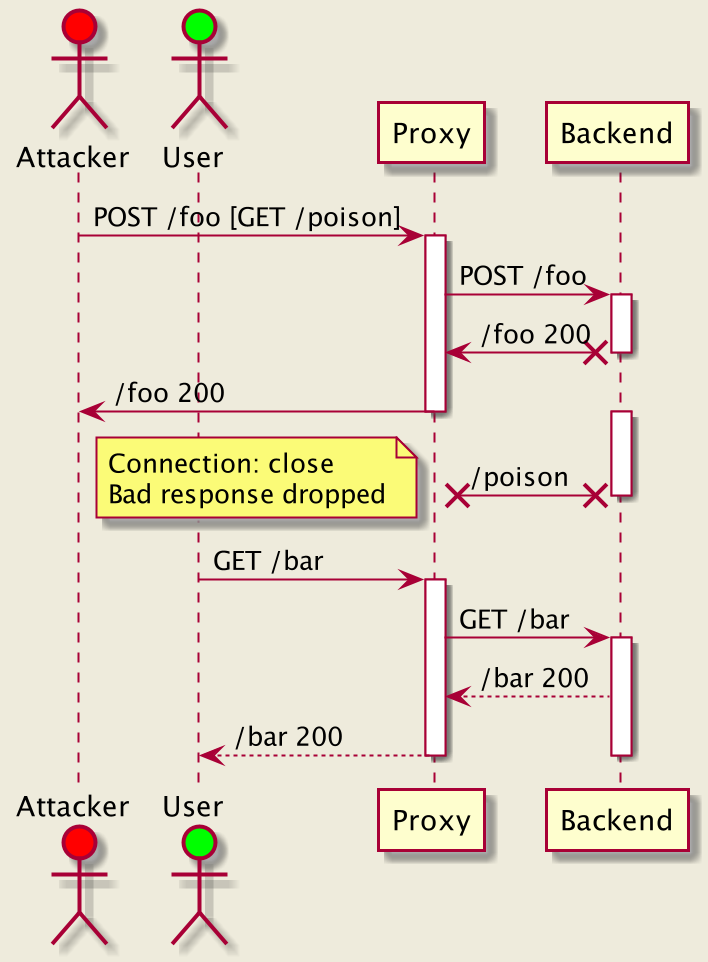
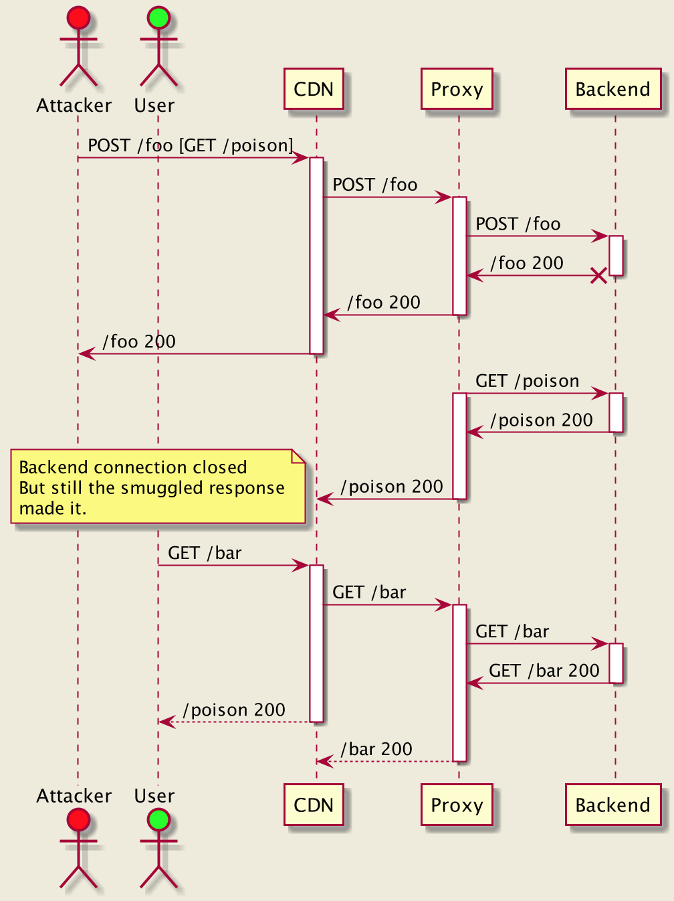
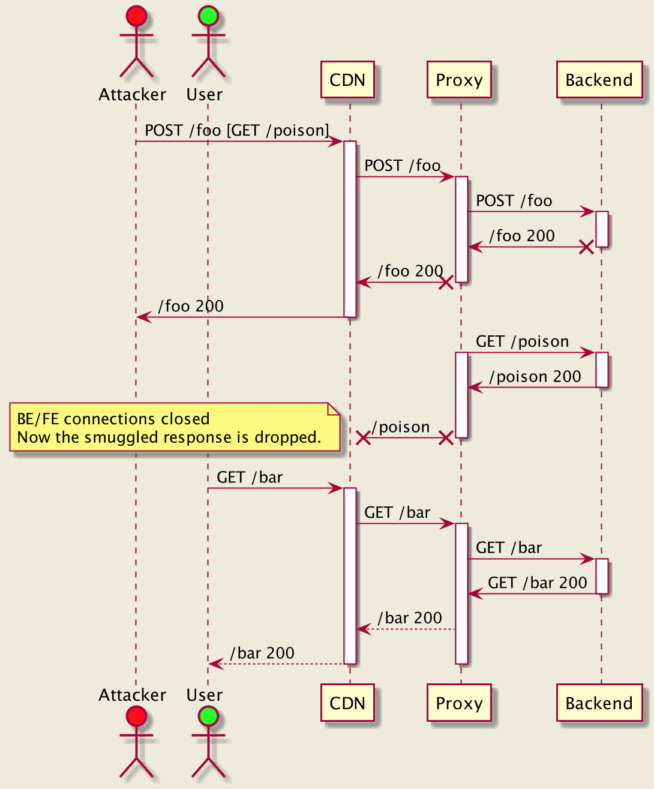

### Overview

This page contains request classification tiers and reasons as well as mitigations, with explanations for some non-trivial cases. 

### Request classification

`http_desync_guardian` is a library for analyzing and classifying HTTP/1.x requests to provide customers security balanced with necessity to serve traffic for legacy or proprietary systems (not always RFC compliant).

* `Compliant` - RFC compliant requests (*)
* `Acceptable` - non RFC compliant requests, but which do not represent security risks
* `Ambiguous` - requests that might be treated differently by different HTTP servers and therefore may lead to HTTP Desync issues (and request splitting/smuggling as a possible consequence)
* `Severe` - either malformed or highly likely crafted to trick HTTP parsers and cause HTTP de-synchronization.

### Recommended `http_desync_guardian` Modes

| Classification | Defensive mode | Strictest mode |
|----------------|----------------|----------------|
| Compliant      | Allowed        | Allowed        |
| Acceptable     | Allowed        | Blocked        |
| Ambiguous      | Allowed¹       | Blocked        |
| Severe         | Blocked        | Blocked        |

¹ Route the requests but closes the client and target connections.

For `Blocked` requests the client connection must be closed.

If you are concerned about potential impact, _Monitoring mode_ offers a metrics-only approach to assess prior to switching.

### Classification Reasons

* `Compliant`
    * `Compliant` - a compliant request
* `Acceptable`
    * `NonCompliantHeader` - non-essential header containing a non-ASCII or control characters (CTL) -  i.e. special invisible characters.
    * `SpaceInUri` - unescaped space in the URI
    * `NonCompliantVersion` - version which contains extra spaces, missing (i.e. HTTP/0.9) or matches HTTP/1.[2-9]
    * `GetHeadZeroContentLength` - GET/HEAD request with a “Content-Length: 0” header
* `Ambiguous`
    * `EmptyHeader` - if there is an empty header or a line with whitespaces only in the request
    * `AmbiguousUri` - an URI containing CTL characters
    * `UndefinedContentLengthSemantics` - Content-Length for GET/HEAD requests
    * `UndefinedTransferEncodingSemantics` - Transfer-Encoding for GET/HEAD requests
    * `DuplicateContentLength` - duplicated Content-Length header (same value)
    * `BothTeClPresent` - both Transfer-Encoding and Content-Length are present in the request
    * `SuspiciousHeader` - a header that can be normalized to `Transfer-Encoding` or `Content-Length` using common text normalization techniques (sanitation, case normalization, delimiters normalization).
* `Severe`
    * `BadHeader` - header containing null-character or CR
    * `BadUri` - URI containing null-character or CR
    * `BadVersion` - malformed version
    * `MultipleContentLength` - different Content-Length headers
    * `BadContentLength` - a non-parseable value or an invalid number
    * `MultipleTransferEncodingChunked` - multiple Transfer-Encoding: chunked headers
    * `BadTransferEncoding` - unknown Transfer-Encoding value
    * `BadMethod` - malformed method
* `Parsing` raw-requests 
    * `NonCrLfLineTermination` (Acceptable) - allowing “\n” line termination (similar to Nginx).
    * `MultilineHeader` (Ambiguous) - multi-line headers are non RFC compliant (except Content-Type)
    * `PartialHeaderLine` (Ambiguous) - if a header line was not terminated
    * `MissingLastEmptyLine` (Ambiguous) - there is no empty line at the end of request
    * `MissingHeaderColon` (Ambiguous) - header line doesn’t have colon separator
    * `MissingUri` (Ambiguous) - there is no URI in the request line

### Details on certain classifications

#### Undefined Content-Length/Transfer-Encoding Semantics (UndefinedTransferEncodingSemantics, UndefinedContentLengthSemantics)

A payload within a GET/HEAD request message has no defined semantics.
https://tools.ietf.org/html/rfc7231#section-4.3

https://medium.com/@knownsec404team/protocol-layer-attack-http-request-smuggling-cc654535b6f
3.1 GET Request with CL != 0

https://portswigger.net/web-security/request-smuggling/exploiting
See "Capturing other users’ requests"
https://www.cgisecurity.com/lib/HTTP-Request-Smuggling.pdf
see "EXAMPLE #3"

#### Both Content-Length and Transfer-Encoding are present (BothTeClPresent)

If a request containing both Content-Length and Transfer-Encoding was received, it means that the sender didn’t follow RFC, and thus there is a chance that request boundaries might be out of sync with the sender.

> If a message is received with both a Transfer-Encoding and a
Content-Length header field, the Transfer-Encoding overrides the
Content-Length. Such a message might indicate an attempt to
perform request smuggling (Section 9.5) or response splitting
(Section 9.4) and ought to be handled as an error. A sender MUST
remove the received Content-Length field prior to forwarding such
a message downstream.

https://tools.ietf.org/html/rfc7230#section-3.3.2

#### Multi-line headers (MultilineHeader)

Multi-line headers have been deprecated in RFC 7230, and different engines may either support it or not, which provides malicious actors a toolkit to trick parser to “see” headers that are not there or vice versa. That’s why we mark requests containing multi-line headers as Ambiguous (except the Content-Type header).

> Historically, HTTP header field values could be extended over multiple lines by
preceding each extra line with at least one space or horizontal tab (obs-fold).
This specification deprecates such line folding except within the message/http media
type (Section 8.3.1). A sender MUST NOT generate a message that includes line folding
(i.e., that has any field-value that contains a match to the obs-fold rule) unless the message
is intended for packaging within the message/http media type.

https://tools.ietf.org/html/rfc7230#section-3.2.4

#### Multiple Transfer-Encoding Chunked (MultipleTransferEncodingChunked)

> A sender MUST NOT apply chunked more than once to a message body

https://tools.ietf.org/html/rfc7230#section-3.3.1

#### Multiple Content-Length Headers (MultipleContentLength, DuplicateContentLength)

If there are multiple different Content-Length headers (different values) the request is marked as Severe.
 In the case of multiple but same values, it falls into DuplicateContentLength category (marked as Ambiguous).

> If a message is received that has multiple Content-Length header
fields with field-values consisting of the same decimal value, or a
single Content-Length header field with a field value containing a
list of identical decimal values (e.g., "Content-Length: 42, 42"),
indicating that duplicate Content-Length header fields have been
generated or combined by an upstream message processor, then the
recipient MUST either reject the message as invalid or replace the
duplicated field-values with a single valid Content-Length field
containing that decimal value prior to determining the message body
length or forwarding the message.

https://tools.ietf.org/html/rfc7230#section-3.3.2

#### Suspicious headers (SuspiciousHeader)

There is a range of attacks to masquerade Transfer-Encoding and Content-Length headers, so some engines in the chain will see them while others won’t. For example:

```
Transfer-Encoding : chunked
Content-Length: 100
```
In this case, some engines may reject this request, as it’s not RFC compliant. Some may sanitize the space before the colon and treat as it has “Transfer-Encoding: chunked” while some may see “Transfer-Encoding[space]” and ignore it. It is the simplest case to illustrate this idea, but there are many others. For instance:

```
Transfer-Encodıng: chunked
```
Small Dotless I becomes ASCII “I” on upper-case transformation which may trick some engines. Or have a CTL character:

```
Transfer_Encoding: chunked
\x01Transfer-Encoding: chunked
Transfer-Encoding\b: chunked
```
Some engines may normalize delimiters or non-letters, e.g., using regular expressions, etc. (especially using standard string trimming routines that may have different behaviors in different platforms).

To mitigate these risks, we determine the similarity of headers to `Transfer-Encoding` and Content-Length and mark requests as Ambiguous if any of these deviations are detected.

### Mitigations

There are two types of mitigations:

* Reject request with 400 and close the connection 
* Serve the request but disable connection re-use on both front-end and back-end.

Why connection is closed after a `Severe` request

In this case, we cannot establish request boundaries and tell when the next request starts.

Why connections are both FE/BE connections closed after an Ambiguous request?

Let’s start with not re-using a backend connection example:


1. Attacker sends a request, such as Proxy only sees POST /foo while backend also sees GET /poison
2. However Proxy marks the request as Ambiguous
3. Proxy closes the connection after the response
4. The /poison response is dropped as the connection is not going to be re-used.

This seems to be efficient, but falls short if there is a layer in front of the proxy:

1. In this case let’s assume Desync happens between CDN and the Proxy and Proxy marks the request as Ambiguous
2. While Proxy closes the BE connection, it’s not helpful
3. The /poison response is still served via re-used front-end connection

But if both FE/BE connections are closed, then HTTP Desync is prevented:

1. Same as in the previous example, let’s assume Desync happens between CDN and the Proxy and Proxy marks the request as Ambiguous
2. Now Proxy closes both FE/BE connections.
3. The /poison response is dropped.

